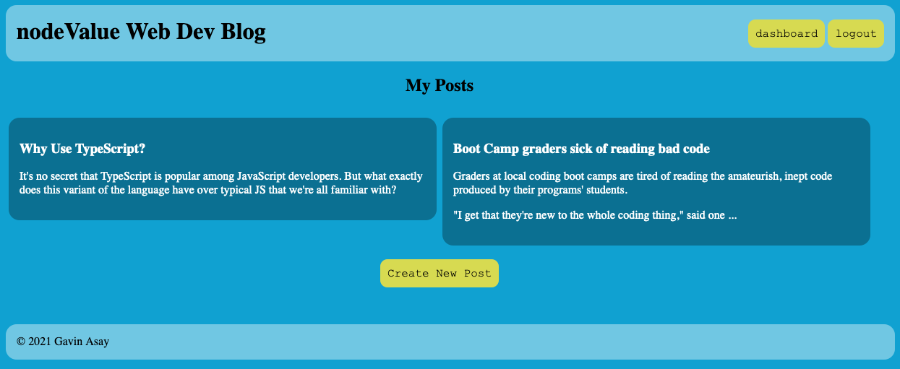

# nodevalue-tech-blog

## Description

NodeValue Tech Blog is a web application built using the MVC paradigm relying on the following technologies:

- Model: Sequelize
- View: Handlebars.js
- Controller: Express.js

These technologies, along with session support, allow for users to create accounts, create and edit posts, as well as add comments to posts.

Repository: https://github.com/gavin-asay/nodevalue-tech-blog

Deploy Link: https://fast-journey-11216.herokuapp.com/

## How to Use
View the deploy link above, or `git clone` the repository, then run `npm start` from the project's root directory, then go to localhost:3001/ in your browser.

